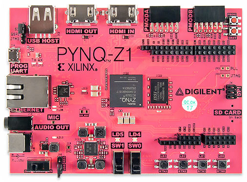

.. Pynquino documentation master file, created by
   sphinx-quickstart on Sun Jun 17 13:19:24 2018.
   You can adapt this file completely to your liking, but it should at least
   contain the root `toctree` directive.

.. Pynquino documentation master file, created by
   sphinx-quickstart on Sun Jun 17 13:19:24 2018.
   You can adapt this file completely to your liking, but it should at least
   contain the root `toctree` directive.

=====================
About Pynquino
=====================
Pynquino is a project which aims to coordinate **Arduino** (open source hardware for makers) with **PYNQ** (Python-friendly FPGA platform by Xilinx).

.. toctree::
  :hidden:

  .. getting_started
  .. blockly
  .. developers
  .. showcases
  .. development_plan

---------------------
Integrate PYNQ and Arduino
---------------------

`PYNQ platform by Xilinx <http://www.pynq.io/>`_ enables software engineers to develop high performance applications using Python on FPGA, such as machine learning and image processing. 

Although official PYNQ boards equip Arduino sockets, developers have to convert Arduino sketches to run the codes over MicroBlaze soft processor. We tried this porting process once, and found it very troublesome. We'd like to make it much easier, to fully release the potential of PYNQ in the embedded projects.

We hope this project would help developers to build applications on the PYNQ, with combining the existing assets of Arduino. 

---------------------
Demo
---------------------
We are currently working for developing a demo project: integration of computer vision feature into RepRap based 3D printer.

* `Firmware (called as Zsprinter) <https://github.com/shohei/zsprinter-pynquino>`_
* `PYNQ-Arduino 3D printing shield <https://github.com/shohei/3dp-shield-rev3>`_

We will describe detailed documents shortly.

